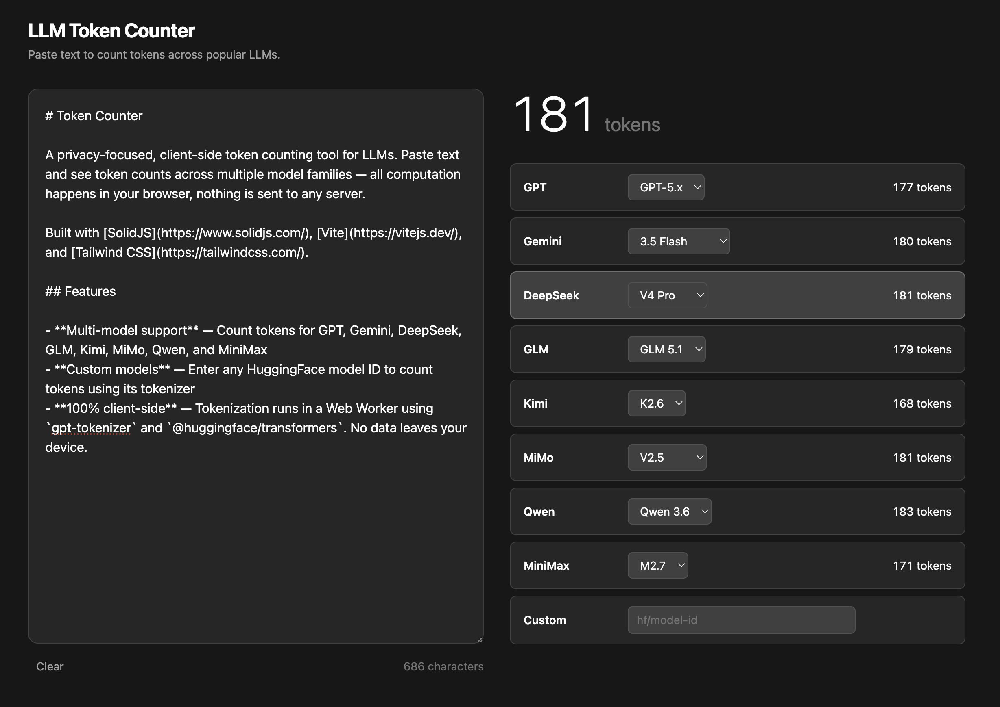

# Token Counter

A privacy-focused, client-side token counting tool for LLMs. Paste text and see token counts across multiple model families — all computation happens in your browser, nothing is sent to any server.

Built with [SolidJS](https://www.solidjs.com/), [Vite](https://vitejs.dev/), and [Tailwind CSS](https://tailwindcss.com/).



## Features

- **Multi-model support** — Count tokens for GPT, Gemini, DeepSeek, GLM, Kimi, MiMo, Qwen, and MiniMax
- **Custom models** — Enter any HuggingFace model ID to count tokens using its tokenizer
- **100% client-side** — Tokenization runs in a Web Worker using `gpt-tokenizer` and `@huggingface/transformers`. No data leaves your device.

## Supported Models

| Family | Tokenizer | Variants |
|---|---|---|
| GPT | o200k_base / cl100k_base | GPT-5.x, GPT-4o, GPT-4 |
| DeepSeek | HuggingFace AutoTokenizer | V4 Pro, V4 Flash, V3.2, V3.1 |
| Gemini | HuggingFace AutoTokenizer | 3.5 Flash, 3.1 Pro, 3.1 Flash Lite |
| GLM | HuggingFace AutoTokenizer | GLM 5.1, GLM 5, GLM 4.7 |
| Kimi | HuggingFace AutoTokenizer | K2.6, K2.5 |
| MiMo | HuggingFace AutoTokenizer | V2.5, V2.5 Pro, V2 Flash |
| Qwen | HuggingFace AutoTokenizer | Qwen 3.6, Qwen 3.5 |
| MiniMax | HuggingFace AutoTokenizer | M2.7, M2.5 |

You can also input any HuggingFace model ID in the **Custom** field for ad-hoc token counting.

## Development

```bash
# Install dependencies
bun install

# Start dev server (default: http://localhost:3000)
bun run dev

# Build for production
bun run build

# Preview production build
bun run serve

# Format code
bun run format
```

### Prerequisites

- [Bun](https://bun.sh/)

## Tech Stack

| Layer | Technology |
|---|---|
| Framework | [SolidJS](https://www.solidjs.com/) |
| Build | [Vite](https://vitejs.dev/) |
| Styling | [Tailwind CSS v4](https://tailwindcss.com/) |
| Language | TypeScript |
| OpenAI Tokenizer | [gpt-tokenizer](https://www.npmjs.com/package/gpt-tokenizer) |
| HF Tokenizer | [Transformers.js](https://hf.co/docs/transformers.js) |
| Worker | Web Worker (off-main-thread tokenization) |

## Architecture

```
src/
├── components/
│   ├── Header.tsx          # App title & description
│   ├── TextInput.tsx       # Text area input
│   ├── TokenDisplay.tsx    # Token count display
│   └── ModelSelector.tsx   # Model family cards & custom input
├── utils/
│   ├── models.ts           # Model definitions & config
│   ├── tokenizer.ts        # Worker communication wrapper
│   └── openai/
│       ├── cl100k_base.ts  # OpenAI cl100k_base encoder
│       └── o200k_base.ts   # OpenAI o200k_base encoder
├── workers/
│   └── tokenizer.worker.ts # Web Worker: all tokenization logic
├── App.tsx                 # Root component
├── index.tsx               # Entry point
└── index.css               # Global styles & Tailwind import
```

Tokenization is offloaded to a **Web Worker** so the UI stays responsive. OpenAI models use the `gpt-tokenizer` library directly, while other models load tokenizers via Transformers.js (cached after first use).

## Building

```bash
bun run build
```

Output goes to `dist/`. The build target is `esnext`, so modern browsers are required.

## License

MIT
